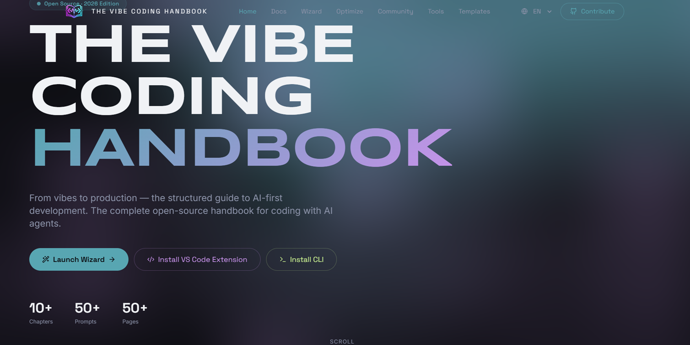
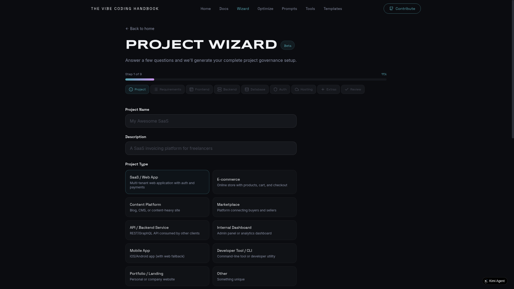
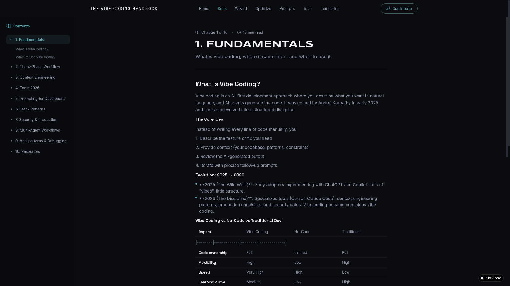

<div align="center">

<!-- Hero Banner -->


<br />

<!-- Badges -->
<a href="https://github.com/dangelBorges/the-vibecoding-handbook/stargazers"></a>
<a href="https://github.com/dangelBorges/the-vibecoding-handbook/network/members"></a>
<a href="https://github.com/dangelBorges/the-vibecoding-handbook/issues"></a>
<a href="./LICENSE"></a>

<br />

<!-- Quick Links -->
<a href="https://vibecoding.guide"><strong>Website</strong></a> ·
<a href="./cli/README.md"><strong>CLI Docs</strong></a> ·
<a href="./vscode-extension/README.md"><strong>VS Code Extension</strong></a> ·
<a href="./docs/"><strong>Handbook</strong></a> ·
<a href="https://github.com/dangelBorges/the-vibecoding-handbook/issues">Report Bug</a> ·
<a href="https://github.com/dangelBorges/the-vibecoding-handbook/issues">Request Feature</a>

<br /><br />

<!-- Install Command -->

```bash
npm install -g @vibecoding/cli
```

</div>

---

## What is Vibe Coding?

**Vibe coding** is the practice of describing software in natural language and letting AI agents generate production-ready code. You focus on *what* to build; the AI handles *how* to build it.

This handbook is the most complete open-source resource for mastering vibe coding — from writing your first prompt to deploying AI-governed projects at scale.

## Screenshots

<div align="center">

**Landing Page** — WebGL-powered hero with Neural Aurora shader



<br /><br />

**Project Wizard** — 9-step interactive decision framework



<br /><br />

**Prompt Optimizer** — Transform vague prompts into structured AI instructions



</div>

---

## The Ecosystem

Three integrated tools that cover the entire vibe coding workflow:

### 1. Web Handbook

An interactive learning platform with 10 chapters, prompt library, tool comparisons, and live generators.

| Feature | Description |
|---------|-------------|
| 10-Chapter Guide | From basics to advanced patterns |
| Prompt Library | 50+ curated prompts with intent detection |
| Tool Comparison | Cursor, Copilot, Claude, v0, and more |
| Project Wizard | 9-step decision framework |
| Prompt Optimizer | Transform vague prompts into structured instructions |
| Template Generator | Download project governance files as ZIP |

**Tech:** React 19 + Vite + TypeScript + Tailwind CSS + WebGL shaders

### 2. CLI (`@vibecoding/cli`)

The command-line companion that **scans your actual codebase** (not templates) to generate intelligent context for AI agents.

```bash
# Initialize project governance
$ vibe init
  ✔ Detected Next.js + TypeScript
  ✔ Created AGENTS.md
  ✔ Created .cursorrules
  ✔ Created .vibecoding/policies/

# The killer feature: auto-detect from your code
$ vibe context --auto
  ✔ Detected Next.js + TypeScript
  ✔ Auth: NextAuth.js    ✔ DB: PostgreSQL (Prisma)
  ✔ Payments: Stripe     ✔ Tests: Vitest
  ✔ Updated AGENTS.md (142 lines)
  → Your AI agent now understands your project.

# Review code against your policies
$ vibe review -s
  Score: 87%
  ⚠ console.log at src/lib/auth.ts:42
  ⚠ `any` type at src/app/page.tsx:17

# Optimize prompts with intent detection
$ vibe optimize "create login page"
  Intent: feature (95%)
  Tokens: ~340 (+180%)
  → Optimized prompt copied to clipboard

# Interactive planning session
$ vibe chat
  ✔ Plan saved to vibe-plan.md
  ✔ Prompt saved to vibe-prompt.md

# Validate project setup
$ vibe check --strict
  Score: 92% — 7 passed · 1 warning · 0 failed

# Sync templates and prompts
$ vibe sync --templates
```

**7 commands. Zero configuration. Maximum context.**

**Tech:** Node.js 20+ + TypeScript + Commander.js

### 3. VS Code Extension

Brings vibe coding governance directly into your IDE.

- **Policy Sidebar** — Browse and validate project policies
- **Decision Tree** — Track Architecture Decision Records (ADRs)
- **Stack Detector** — Auto-detects your tech stack from dependencies
- **Context Panel** — Preview AGENTS.md and .cursorrules without leaving the editor
- **Quick Commands** — `Ctrl+Shift+P` → "Vibe: Initialize Project", "Vibe: Check Policies", "Vibe: Optimize Prompt"

---

## Why This Project is Different

| Capability | Other Tools | The Vibe Coding Handbook |
|-----------|-------------|------------------------|
| Context generation | Generic templates | **Reads your actual codebase** |
| AGENTS.md | Same for everyone | **Unique per project, auto-updated** |
| Framework support | 2-3 hardcoded | **15+ frameworks detected** |
| Prompt optimization | Simple wrapping | **Intent-aware + project context** |
| Code review | Generic rules | **Reads your .cursorrules** |
| Learning resource | Blog posts | **10 chapters + interactive tools** |

---

## Quick Start

### CLI

```bash
# Install globally
npm install -g @vibecoding/cli

# Initialize your first vibe-coded project
cd my-project
vibe init

# Scan your codebase and generate context
vibe context --auto

# Check your setup
vibe check
```

### VS Code Extension

1. Open VS Code
2. Go to Extensions (Ctrl+Shift+X)
3. Search "Vibe Coding"
4. Click Install
5. Open the Command Palette (Ctrl+Shift+P) → "Vibe: Initialize Project"

### Web Handbook

Visit **[vibecoding.guide](https://vibecoding.guide)** to start learning.

---

## Project Structure

```
the-vibecoding-handbook/
├── web/                          # Interactive handbook (React + Vite)
│   ├── src/
│   │   ├── pages/               # Docs, Prompts, Tools, Wizard, Optimizer
│   │   ├── sections/            # Landing page sections
│   │   ├── components/          # NeuralAurora, CustomCursor, etc.
│   │   └── data/                # Content data
│   └── package.json
│
├── cli/                          # @vibecoding/cli (Node.js)
│   ├── src/
│   │   ├── commands/            # init, context, review, optimize, chat, check, sync
│   │   └── utils/               # scanner, ui, optimizer engine
│   └── package.json
│
├── vscode-extension/             # VS Code extension
│   ├── src/
│   │   ├── providers/           # Tree views (Policy, Decision, Stack)
│   │   ├── panels/              # Webview panels
│   │   └── commands/            # Extension commands
│   └── package.json
│
├── docs/                         # Additional documentation
└── .github/                      # GitHub templates and workflows
```

---

## Features in Detail

### Smart Codebase Scanner

The CLI's `vibe context --auto` command reads your `package.json`, directory structure, and configuration files to detect:

- **Framework:** Next.js, React, Vue, Svelte, Astro, Nuxt, Fastify, Express
- **Database:** Prisma, Drizzle, Mongoose, Supabase, Firebase
- **Auth:** NextAuth, Clerk, Supabase Auth, JWT, Passport
- **Payments:** Stripe, LemonSqueezy
- **Testing:** Vitest, Jest, Playwright, Cypress
- **Styling:** Tailwind CSS, Styled Components, Emotion, Sass
- **API Style:** tRPC, GraphQL, REST + React Query
- **Code Conventions:** Server/client separation, loading/error patterns, co-located tests

Then it generates a **unique AGENTS.md** tailored to your project — not a generic template.

### Prompt Optimizer

Transforms vague prompts into structured instructions:

| Before | After |
|--------|-------|
| "create login form" | `# Senior Developer\n\n## Context\n[Your project stack]\n\n## Task\nCreate a login form with...\n\n## Constraints\n- TypeScript strict mode\n- Follow existing Next.js patterns\n- Write tests\n- Handle edge cases\n- Ensure accessibility` |

### Project Decision Wizard

A 9-step interactive wizard that helps you decide:
- Frontend framework (Next.js vs React vs Vue)
- Backend approach (Serverless vs API vs Full-stack)
- Database (PostgreSQL vs MongoDB vs Supabase)
- Auth strategy (OAuth vs Email vs Magic Links)
- Styling approach (Tailwind vs CSS-in-JS)
- Testing strategy (Unit vs Integration vs E2E)
- AI tools (Cursor vs Copilot vs Claude)
- Deployment (Vercel vs Railway vs Self-hosted)
- Team workflow (Branching, PRs, Code Review)

---

## Documentation

- [CLI Documentation](./cli/README.md) — All 7 commands with examples
- [VS Code Extension](./vscode-extension/README.md) — Installation and usage
- [Contributing Guide](./.github/CONTRIBUTING.md) — How to contribute
- [Changelog](./CHANGELOG.md) — Version history

---

## Roadmap

See the [open issues](https://github.com/dangelBorges/the-vibecoding-handbook/issues) for a full list of proposed features and known issues.

### Phase 1 — Foundation (Current)

- [x] Interactive web handbook with 10 chapters
- [x] CLI with 7 commands
- [x] VS Code extension
- [x] Project Decision Wizard
- [x] Prompt Optimizer
- [x] Smart codebase scanner

### Phase 2 — AI Integration

- [x] `vibe chat` with OpenAI/Claude API integration
- [x] Auto-fix suggestions in `vibe review --fix`
- [ ] AI-powered prompt templates
- [ ] Natural language to AGENTS.md generation

### Phase 3 — Community

- [ ] Community prompt library (share and vote)
- [ ] Template marketplace
- [ ] GitHub Action for CI/CD vibe checks
- [ ] Multi-language support (Spanish, Portuguese, Chinese)

---

## Contributing

Contributions are what make the open-source community such an amazing place to learn, inspire, and create. Any contributions you make are **greatly appreciated**.

See [CONTRIBUTING.md](./.github/CONTRIBUTING.md) for guidelines.

### Top Contributors

<a href="https://github.com/dangelBorges/the-vibecoding-handbook/graphs/contributors">
  
</a>

---

## License

Distributed under the MIT License. See [LICENSE](./LICENSE) for more information.

---

## Acknowledgments

- Inspired by the vibe coding movement started by [Andrej Karpathy](https://twitter.com/karpathy)
- Built with [React](https://react.dev), [Vite](https://vitejs.dev), [Tailwind CSS](https://tailwindcss.com), and [shadcn/ui](https://ui.shadcn.com)
- CLI powered by [Commander.js](https://github.com/tj/commander.js) and [Chalk](https://github.com/chalk/chalk)

---

<div align="center">

**If this project helped you, please give it a star!** ⭐

[](https://star-history.com/#dangelBorges/the-vibecoding-handbook&Date)

</div>
